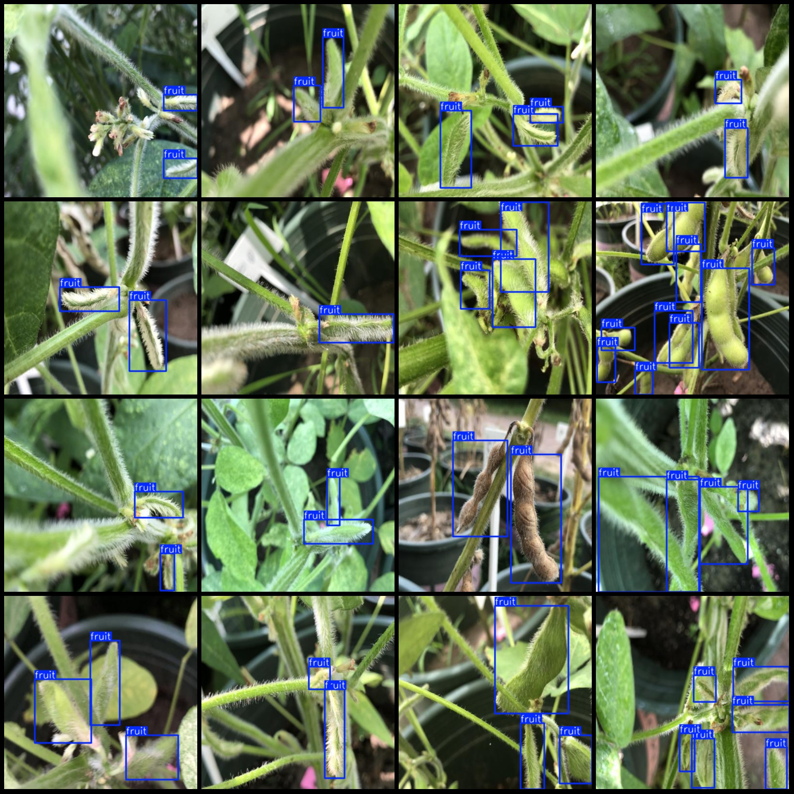
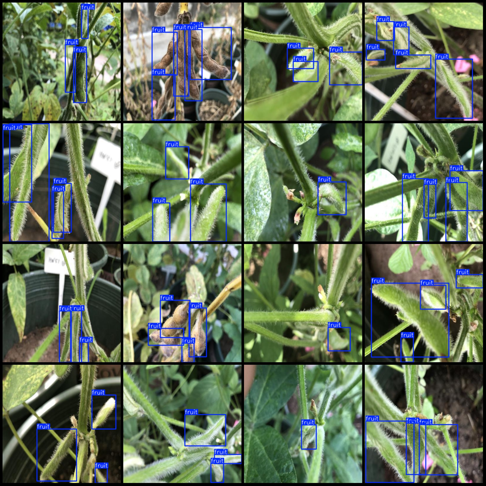

# Smart Agriculture Field Soybean, Yellow Soybean and Grain Cob Detection Dataset VOC+YOLO Format with 2688 Categories

Dataset Format: Pascal VOC format + YOLO format (txt file without split path, only containing jpg images along with corresponding VOC format xml files and yolo format txt files)
Number of Images (jpg file count): 2688
Number of Annotations (xml file count): 2688
Number of Annotations (txt file count): 2688
Number of Annotation Categories: 1
Annotation Category Name: ["fruit"]
Number of Boxes per category:
fruit boxes = 9031
Total boxes: 9031
Image Resolution: 400x400
Annotation Tool Used: labelImg
Annotation Rules: Draw rectangle boxes around the category
Important Notice: The dataset does not have been divided into training validation test sets. Please divide it yourself.
Special Notice: This dataset does not guarantee the accuracy of the trained model or weight files.
Image Preview:
Annotation Example:

Image

Here is a pay link on Stripe ( https://buy.stripe.com/3cs8yP7sY87d0vu9AB ). Please contact me lonlonago@foxmail.com after funding $89, and I will send you a complete data files , thank you!

